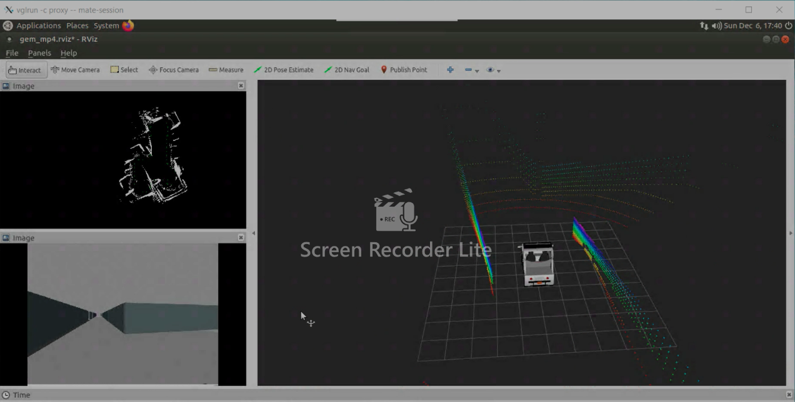

# 3D-LiDAR-SLAM
Simultaneous localization and mapping (SLAM) algorithm implementation with Python, ROS, Gazebo, Rviz, Velodyne LiDAR for Autonomous Vehicle. This project was built upon the Polaris GEM simulation platform. The image shown below the final state of the mapping and localization algorithm with trajectory taken plotted in green. The car follows preset waypoints, but our algorithm does not have access to its positional and spatial context with respect to the global map. The algorithm uses a 2D transformed representation from a 3D point cloud and transforms the planar point cloud into space fram coordinates and plots the obstacles as white points. The noise found in the data can be attributed to rings formed by the LiDAR sensor hitting the ground and returing a point from that. Please click on the image to see the YouTube video!
 

